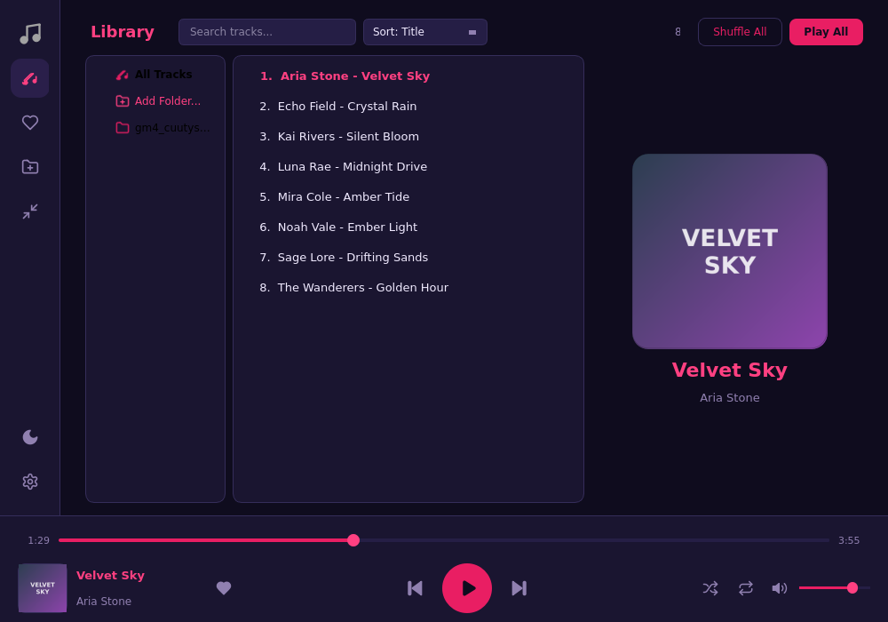
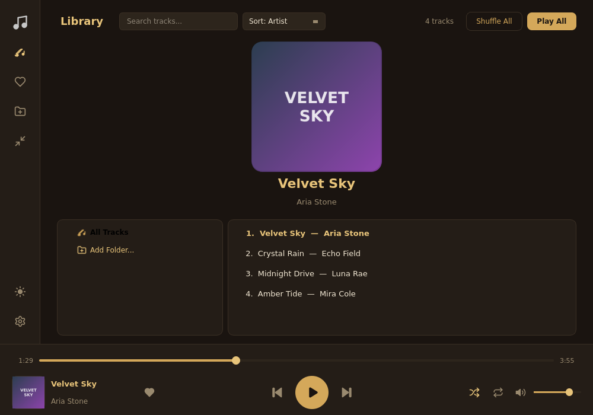
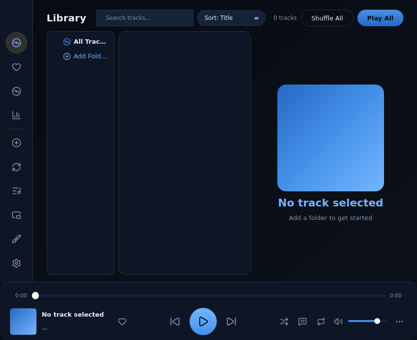
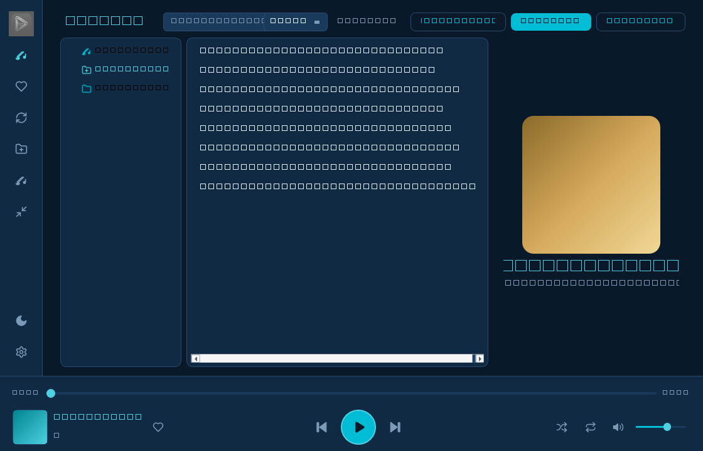

<div align="center">


# 🎵 Golden Music

### A beautiful, modern music player for Windows

*Listen to your music in style — 14 themes, zero clutter, pure enjoyment.*

---


</div>

---

## 📸 Screenshots

<table>
<tr>
<td align="center"><b>Aurora Theme</b></td>
<td align="center"><b>Dark Gold Theme</b></td>
</tr>
<tr>
<td></td>
<td></td>
</tr>
<tr>
<td align="center"><b>Midnight Blue</b></td>
<td align="center"><b>Ocean Cyan</b></td>
</tr>
<tr>
<td></td>
<td></td>
</tr>
</table>

---

## ✨ Features

### 🎨 Beautiful & Modern Interface
- **14 stunning themes** — Aurora, Dark Gold, Light Gold, Midnight Blue, Forest Green, Rose Gold, Carbon Black, Ocean Cyan, Sunset Pink, Emerald, Lavender, Sand, Crimson, Teal
- **Modern SVG icons** — Clean Lucide/Feather-style line-art throughout
- **Two-column layout** — Track list on the left, album art on the right
- **Custom logo** — Golden play button branding
- **System tray integration** — Minimize to tray, quick controls

### 🎵 Powerful Playback
- **All popular formats** — MP3, WAV, FLAC, OGG, OGA, Opus, M4A, AAC, WMA
- **Windows Media Foundation / FFmpeg** backends for superior audio quality
- **Click-to-seek** progress bar — Jump anywhere instantly
- **Smooth volume control** — Click or drag, with mute memory
- **Shuffle & Repeat** — Off / All / One modes
- **History-aware shuffle** — Previous retraces the actual listening path; Next replays forward after going back
- **Global media keys** — Play/Pause/Stop/Next/Prev from keyboard or headset
- **Album cover art** — Extracted automatically from file metadata

### 📚 Smart Library Management
- **Add folders** with recursive subfolder scanning
- **Full folder tree** — Every nesting level shown and filterable
- **Personal playlists** — Create, rename, delete; add tracks via right-click
- **Duplicate finder** — Groups same-song copies; keep one, remove the rest (files on disk untouched)
- **Instant search** — Filter by title or artist
- **Sort by** Title, Artist, Date Added, or Filename
- **Jump to Playing** (`Ctrl+J`) — Scroll the list to the current track
- **Drag & drop** — Drop folders or audio files from Explorer to add them
- **Track properties** — Format, duration, bitrate, sample rate, size + "Open File Location"
- **Right-click context menu** — Play, Favorites, Playlists, Remove, Properties
- **Refresh button** — Rescan folders for new or removed tracks
- **Auto-rescan** on startup (configurable)
- **Tag caching** — Instant loading on subsequent launches

### 🛡️ Reliability
- **Single-instance** — Launching again focuses the running window instead of erroring
- **Crash guard** — Unexpected exceptions are logged, the app keeps running
- **Rotating file log** — Diagnostics written next to the config (`~/.goldenmusic/goldenmusic.log`)
- **Validated config loading** — Corrupted settings files never crash startup

### ⚡ Performance & Stability
- **Async everything** — No UI freeze, even with 2000+ songs
- **Background tag loading** — Library appears instantly, tags load progressively
- **Progress bars** for all heavy operations
- **Crash-proof** — Every operation wrapped in error handling
- **Memory efficient** — Cached data with automatic cleanup

### 🎯 User Experience
- **Mini Player** — Compact floating window (`Ctrl+M`)
- **Sleep Timer** — Auto-stop after N minutes
- **Keyboard shortcuts** — Full control without touching the mouse
- **Settings dialog** — 4 tabs (Appearance, Playback, Library, About)
- **Remember last track** — Resume where you left off
- **13 themes picker** — Visual swatch grid for instant switching

---

## ⌨️ Keyboard Shortcuts

| Shortcut | Action |
|----------|--------|
| `Space` | Play / Pause |
| `Ctrl + ←` | Previous track |
| `Ctrl + →` | Next track |
| `Ctrl + ↑` | Volume Up |
| `Ctrl + ↓` | Volume Down |
| `Ctrl + F` | Focus search bar |
| `Ctrl + M` | Toggle Mini Player |
| `Ctrl + J` | Jump to the playing track |

*Media keys (Play/Pause/Stop/Next/Prev) on your keyboard or headset work globally.*

---

## 🚀 Quick Start

### Option 1: Download Installer (Recommended)

1. Go to [Releases](../../releases)
2. Download `GoldenMusicSetup-1.1.0.exe`
3. Run the installer — it detects an existing installation and updates in place; your library, favorites and settings are preserved
4. Enjoy your music! 🎉

### Option 2: Run from Source

```bash
# Clone the repository
git clone https://github.com/Amirmpm/golden-music.git
cd golden-music

# Install dependencies (pywin32 adds media keys + single-instance on Windows)
pip install -r requirements.txt pywin32

# Run
python main.py
```

### Option 3: Build the Portable exe / Installer Yourself

**Prerequisites:**
- [Python 3.12+](https://www.python.org/downloads/)
- [Inno Setup 6](https://jrsoftware.org/isdl.php) (installer only)

```bash
# Optimized portable build only (~80 MB, trims unused Qt DLLs, UPX-packed)
python build_release.py

# Full pipeline: tests -> exe -> installer
build_windows.bat
```

Output:
- `dist\GoldenMusic\GoldenMusic.exe` — The app (portable folder)
- `dist\installer\GoldenMusicSetup-1.1.0.exe` — The installer

---

## 📁 Project Structure

```
golden-music/
├── main.py                  # Main application window
├── config.py                # Themes, QSS stylesheets, safe loaders
├── applog.py                # Rotating file logging + Qt message hook
├── mediakeys.py             # Global Windows media key hotkeys
├── trackinfo.py             # Track technical metadata reader
├── track_info_dialog.py     # Properties dialog + Open File Location
├── playlist_dialog.py       # Personal playlists UI + store
├── duplicates.py            # Duplicate grouping engine
├── duplicates_dialog.py     # Duplicates review/cleanup dialog
├── icons.py                 # SVG icon library (30+ icons)
├── audio.py                 # PyQt6 QMediaPlayer audio backend
├── scanner.py               # Async folder scanner (QThread)
├── coverart.py              # Album art extraction (thread-safe)
├── widgets.py               # ClickableSlider widget
├── tray_menu.py             # Custom tray popup menu
├── theme_picker.py          # Theme swatch picker popup
├── settings_dialog.py       # Settings dialog (4 tabs)
├── mini_player.py           # Compact floating player
├── scripts/                 # 7 offline test suites (106 tests)
├── requirements.txt         # Python dependencies
├── goldenmusic.spec         # PyInstaller spec (optimized)
├── goldenmusic.iss          # Inno Setup installer script
├── build_release.py         # Optimized exe build + trim + size report
├── build_windows.bat        # One-click: tests -> exe -> installer
├── .github/workflows/       # CI: tests + Bandit + build artifacts
├── assets/                  # Icons, logos, images
│   ├── logo.png             # Custom app logo
│   ├── icon.png             # App icon (512x512)
│   ├── icon.ico             # Windows icon (multi-size)
│   └── icon_*.png           # Various sizes
├── screenshots/             # App screenshots for README
├── LICENSE                  # MIT License
├── README.md                # This file
├── CONTRIBUTING.md          # Contribution guidelines
├── CHANGELOG.md             # Version history
├── INSTALLATION.md          # Detailed installation guide
└── .gitignore               # Git ignore rules
```

---

## 🎨 Themes

Golden Music ships with **14 beautiful themes**:

| Theme | Style | Primary Color |
|-------|-------|---------------|
| Aurora | Dark | Pink/Magenta |
| Dark Gold | Dark | Gold |
| Light Gold | Light | Gold |
| Midnight Blue | Dark | Blue |
| Forest Green | Dark | Green |
| Rose Gold | Dark | Rose |
| Carbon Black | Dark | Silver |
| Ocean Cyan | Dark | Cyan |
| Sunset Pink | Dark | Pink |
| Emerald | Dark | Emerald |
| Lavender | Dark | Purple |
| Sand | Light | Sand |
| Crimson | Dark | Red |
| Teal | Dark | Teal |

Click the **theme icon** in the sidebar to open the visual theme picker and switch instantly.

---

## 🛠️ Tech Stack

| Technology | Purpose |
|------------|---------|
|  | Core language |
|  | GUI framework |
|  | Audio metadata |
|  | EXE packaging |
|  | Windows installer |

---

## 📦 Configuration

Golden Music stores its configuration at:

```
%USERPROFILE%\.goldenmusic\
├── config.json          # App settings, library, favorites
└── tag_cache.json       # Cached metadata for instant loading
```

**What's stored:**
- Added folders, library tracks, favorites
- Last played track and position
- Volume, theme, shuffle/repeat state
- Window geometry
- All settings preferences

---

## 🤝 Contributing

**We welcome contributions from everyone!** 🎉

Golden Music is an open-source project and we'd love your help to make it even better. Whether you're a developer, designer, translator, or just have a great idea — there's a place for you here.

### Ways to Contribute

- 🐛 **Report bugs** — Found a bug? [Open an issue](../../issues/new)
- 💡 **Suggest features** — Have an idea? [Let us know](../../issues/new)
- 🎨 **Design themes** — Create new color themes
- 🌍 **Translate** — Help translate the UI
- 📝 **Improve docs** — Fix typos, add guides
- 🔧 **Submit code** — Fix bugs, add features via Pull Request

### How to Contribute

1. **Fork** the repository
2. **Clone** your fork:
   ```bash
   git clone https://github.com/Amirmpm/golden-music.git
   ```
3. **Create a branch**:
   ```bash
   git checkout -b feature/my-awesome-feature
   ```
4. **Make your changes** and test them
5. **Commit** with a clear message:
   ```bash
   git commit -m "feat: add awesome new feature"
   ```
6. **Push** to your fork:
   ```bash
   git push origin feature/my-awesome-feature
   ```
7. **Open a Pull Request** 🚀

### 📋 Requesting a Version Upgrade

Want a new feature or improvement in the next version? Here's how:

1. **Check existing issues** — Someone may have already requested it
2. **Open a new issue** with the label `enhancement` or `feature-request`
3. **Describe clearly** what you'd like and why it's useful
4. **Upvote** existing requests with 👍

We review all requests and prioritize based on community interest and feasibility.

See [CONTRIBUTING.md](CONTRIBUTING.md) for detailed guidelines.

---

## 📝 License

This project is licensed under the **MIT License** — see [LICENSE](LICENSE) for details.

```
MIT License

Copyright (c) 2026 Golden Music

Permission is hereby granted, free of charge, to any person obtaining a copy
of this software and associated documentation files...
```

**In short:** You're free to use, modify, distribute, and even sell this software. Just keep the copyright notice.

---

## 🙏 Acknowledgments

This project stands on the shoulders of giants:

- **[PyQt6](https://www.riverbankcomputing.com/software/pyqt/)** — by Riverbank Computing
- **[mutagen](https://mutagen.readthedocs.io/)** — Audio metadata library
- **[Lucide](https://lucide.dev/)** — Icon design inspiration
- **[Inno Setup](https://jrsoftware.org/isinfo.php)** — by Jordan Russell
- **[Python](https://www.python.org/)** — The language that makes it all possible

---

## 📊 Project Stats


---

## 🗺️ Roadmap

### Version 1.x
- [ ] Equalizer (10-band)
- [ ] Crossfade between tracks
- [ ] System media key integration
- [ ] Playlist management (custom playlists)
- [ ] Lyrics display

### Version 2.x
- [ ] Multi-language support
- [ ] Cloud sync for favorites
- [ ] Podcast support
- [ ] Theme editor
- [ ] Mobile companion app

*Have an idea for the roadmap? [Suggest it!](../../issues/new)*

---

## 💬 Community

- 🐛 [Report a Bug](../../issues/new?labels=bug)
- 💡 [Request a Feature](../../issues/new?labels=enhancement)
- 💬 [Start a Discussion](../../discussions)
- 📧 Contact: [Open an issue](../../issues/new)

---

<div align="center">

### ⭐ If you like Golden Music, give it a star! ⭐

**Made with ❤️ and lots of ☕**

*First public release — Version 1.0.0*

</div>
