<div align="center">

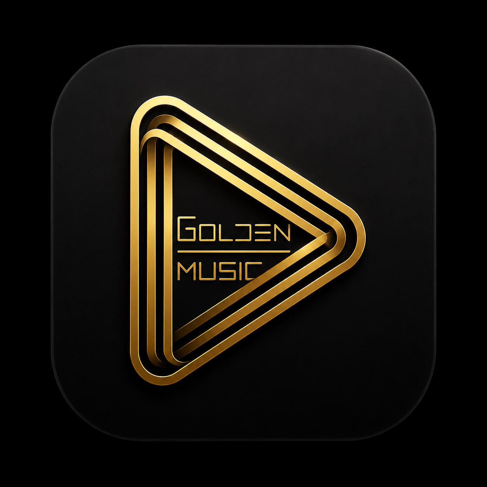

# 🎵 Golden Music

### The modern Windows music player that stays out of your way

*12 psychology-driven themes · Smart shuffle · Glass tray popup · Zero clutter*

[](../../releases)
[](https://www.python.org/)
[](https://www.riverbankcomputing.com/software/pyqt/)
[](#)
[](LICENSE)
[](.github/workflows/ci.yml)
[](../../stargazers)

</div>

---

## 📸 Screenshots

Every theme pairs a dark shot with its light twin — six matched duos:

<table>
<tr>
<td align="center"><b>👑 Royal Gold</b></td>
<td align="center"><b>🏺 Ivory Gold</b></td>
</tr>
<tr>
<td>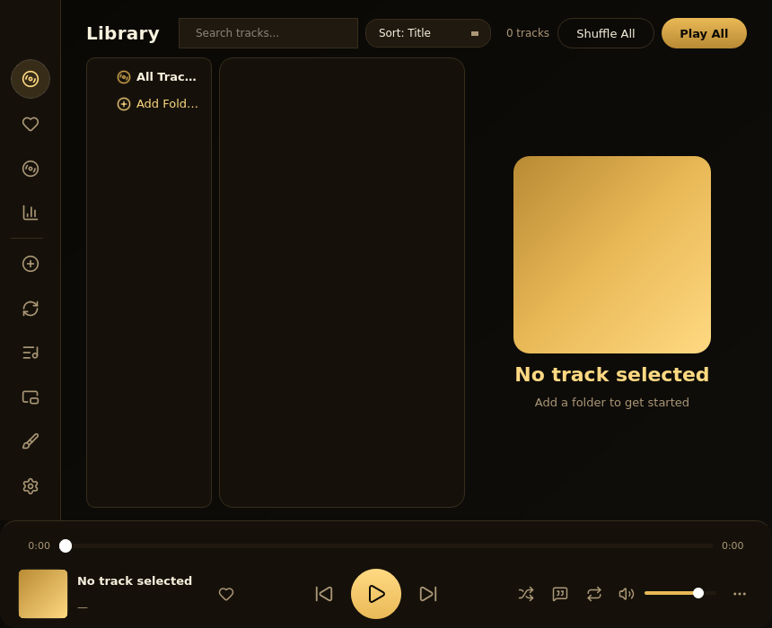</td>
<td>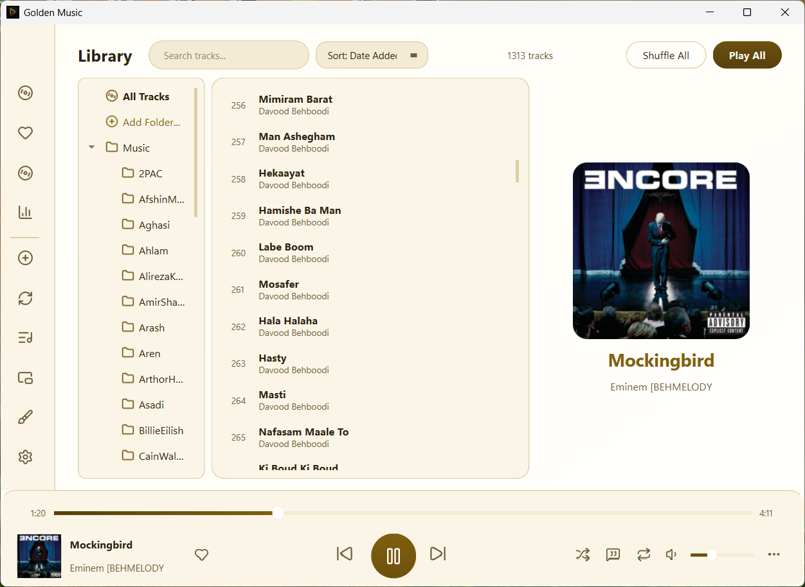</td>
</tr>
<tr>
<td align="center"><b>🌙 Midnight Blue</b></td>
<td align="center"><b>☀️ Clear Azure</b></td>
</tr>
<tr>
<td>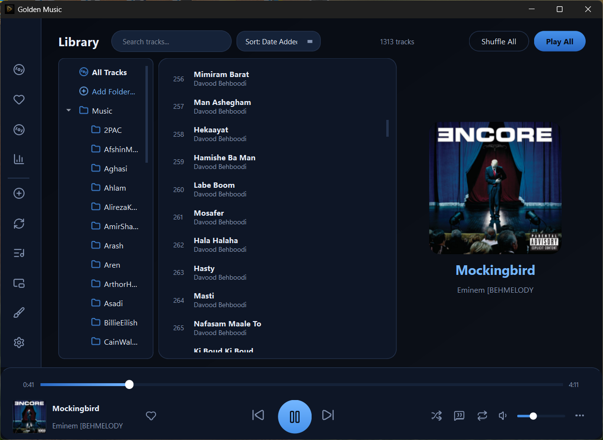</td>
<td>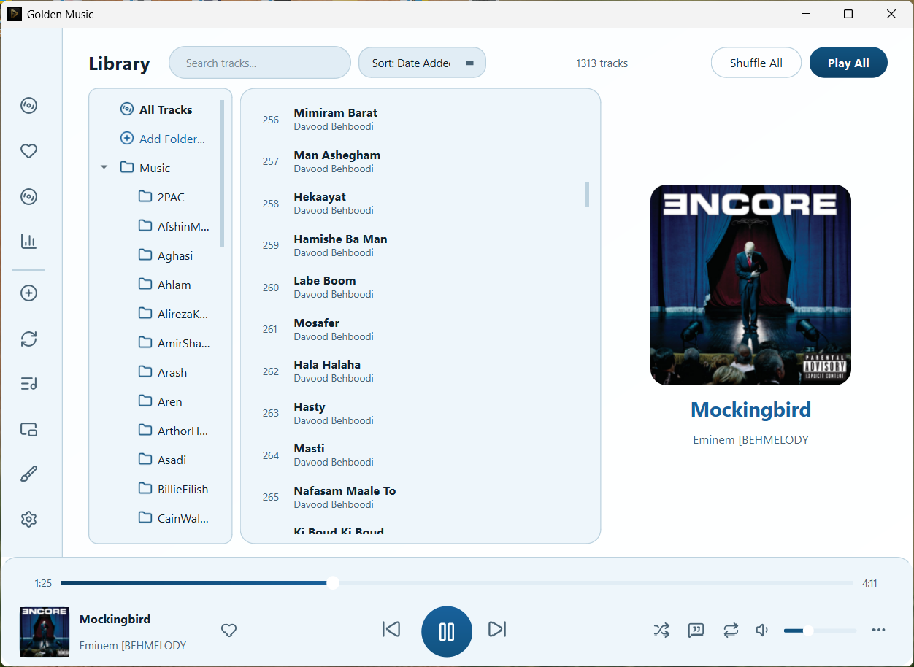</td>
</tr>
<tr>
<td align="center"><b>🔮 Deep Amethyst</b></td>
<td align="center"><b>💜 Soft Lilac</b></td>
</tr>
<tr>
<td>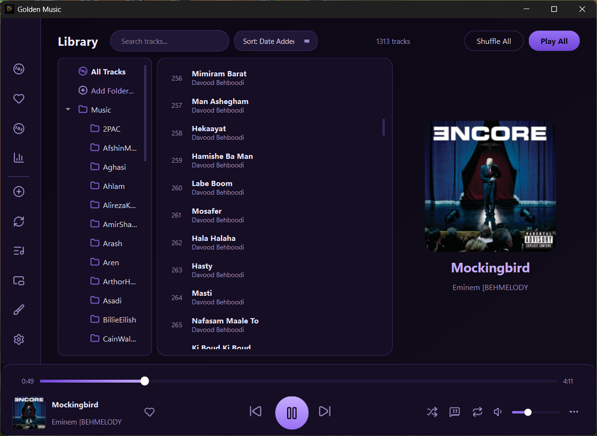</td>
<td>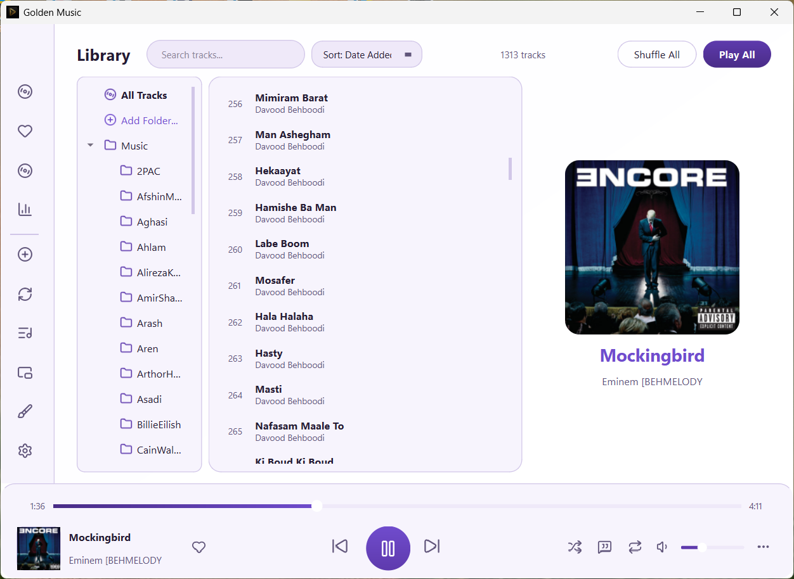</td>
</tr>
<tr>
<td align="center"><b>🌹 Neon Rose</b></td>
<td align="center"><b>🌸 Rose Blush</b></td>
</tr>
<tr>
<td>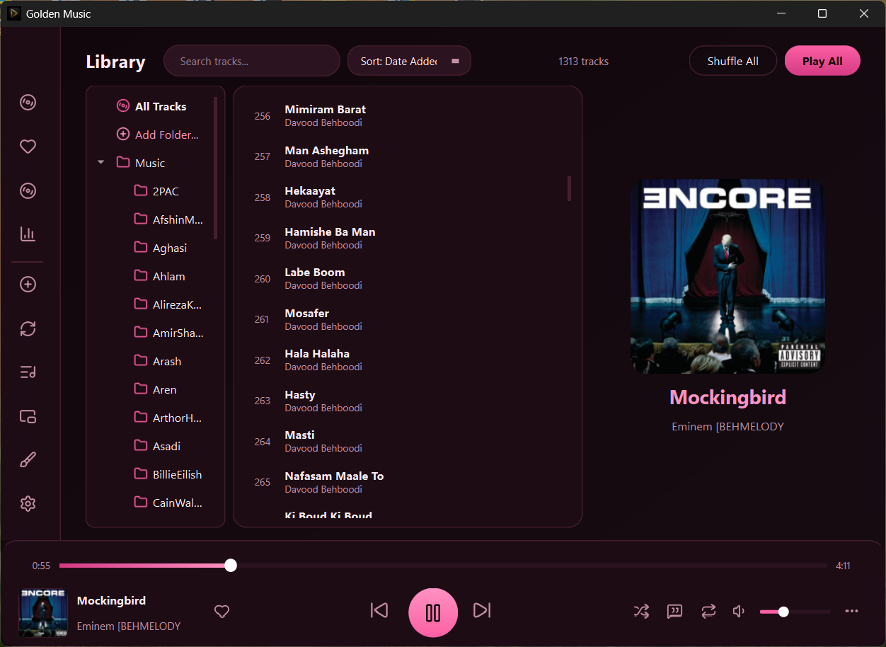</td>
<td>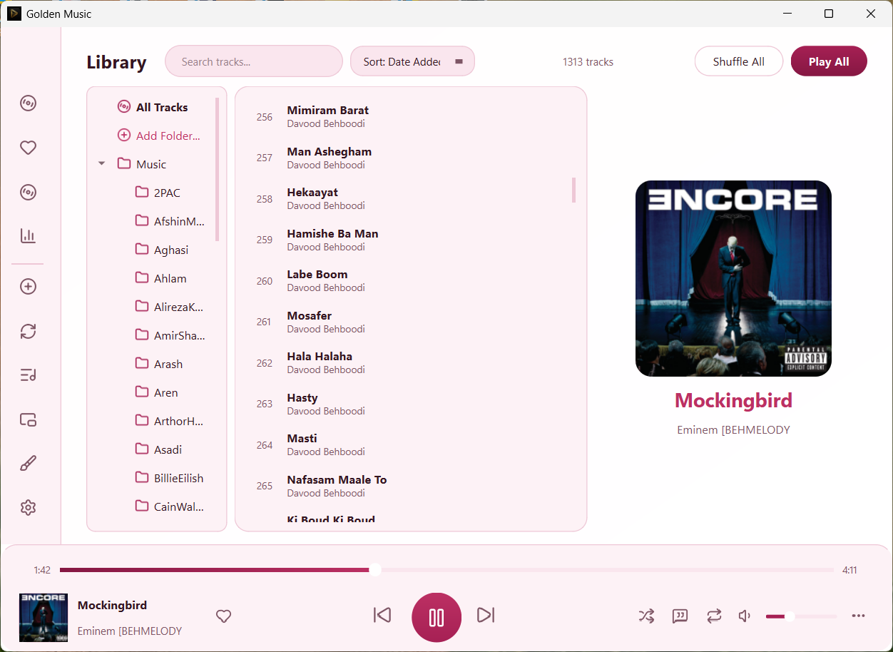</td>
</tr>
<tr>
<td align="center"><b>🌲 Emerald Night</b></td>
<td align="center"><b>🌿 Fresh Sage</b></td>
</tr>
<tr>
<td>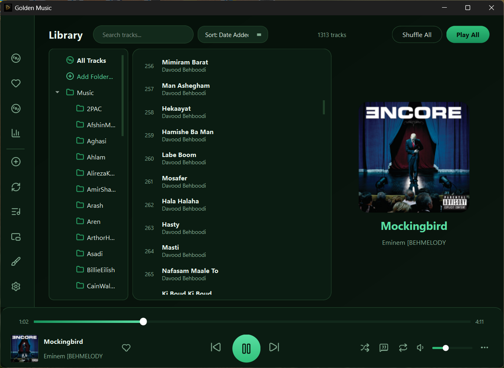</td>
<td>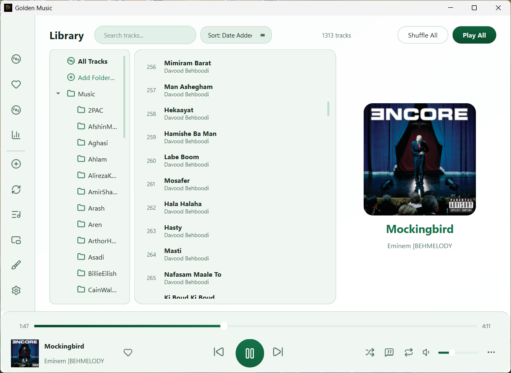</td>
</tr>
<tr>
<td align="center"><b>🖤 Obsidian Black</b></td>
<td align="center"><b>🤍 Porcelain White</b></td>
</tr>
<tr>
<td>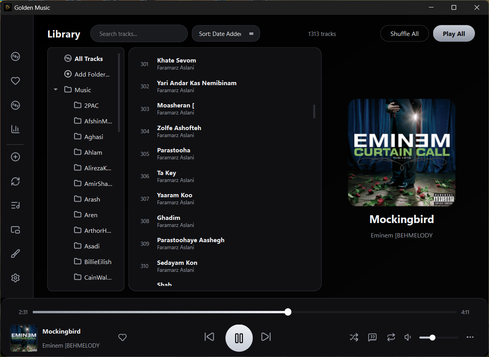</td>
<td>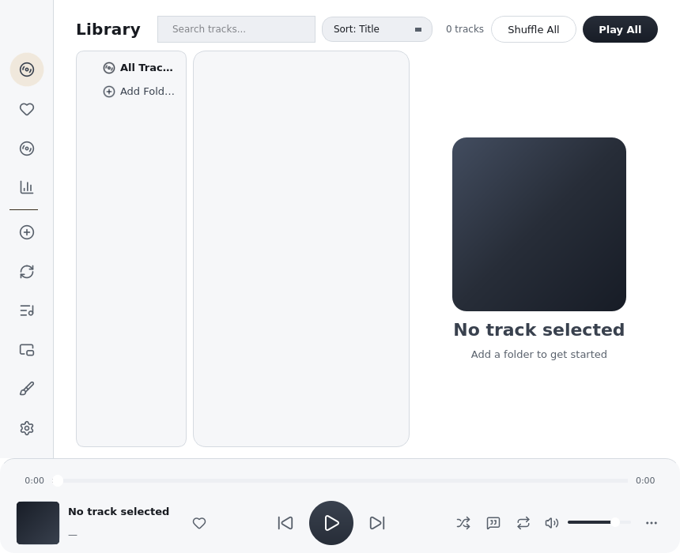</td>
</tr>
</table>

*All twelve themes, captured live from the app. Click any screenshot for the full-size view.*

---

## ✨ Highlights

### 🎨 A theme for every mood — built on color psychology

**Six dark themes** (black-dominant, OLED-friendly) and **six light themes**
(white-dominant, high readability), each pairing a monochrome base with one
accent hue — gold, blue, purple, pink, green or pure silver/graphite. Every
palette was contrast-checked so text stays readable on both OS dark and light
mode.

| 🌑 Dark | ☀️ Light |
|---|---|
| **Royal Gold** — luxury, confidence | **Ivory Gold** — warmth, quiet prestige |
| **Midnight Blue** — nocturnal calm, trust | **Clear Azure** — trust, concentration |
| **Deep Amethyst** — mystery, imagination | **Soft Lilac** — creativity, mindfulness |
| **Neon Rose** — bold, modern energy | **Rose Blush** — compassion, playfulness |
| **Emerald Night** — nature, tranquility | **Fresh Sage** — balance, lowest eye strain |
| **Obsidian Black** — rest & discipline | **Porcelain White** — clarity, Swiss-grid focus |

The **brush button** in the sidebar opens a grouped DARK/LIGHT swatch picker,
or enable *Auto theme* (Settings → Interface) to follow Windows' dark/light
mode automatically.

### 🎵 Playback that feels right

- **All popular formats** — MP3, WAV, FLAC, OGG, OGA, Opus, M4A, AAC, WMA (FFmpeg-backed)
- **Smart shuffle** — tracks you haven't played this session come first; everything gets a turn before anything repeats
- **History-aware Previous** — in shuffle mode, Previous retraces the *actual* listening path instead of picking a new random track
- **A-B Repeat & Playback Speed** (0.5×–2×) tucked into the tidy **⋯ menu**
- **Click-to-seek and drag-to-seek** progress bar with live time preview
- **Smooth volume fades** on pause and track change (configurable)
- **Global media keys** — Play/Pause/Stop/Next/Prev from your keyboard or headset
- **Sleep timer** — stop playback after N minutes
- **Album cover art** — extracted automatically from file metadata

### 🧩 A redesigned player bar

The control cluster was decluttered: shuffle, lyrics, repeat and volume stay
on the bar; less-used actions (A-B repeat, speed, track options) live behind
the **⋯** button. Two-line track rows (bold title over muted artist) read
like modern streaming apps, and the playing row glows gold.

### 🛞 A tray popup that actually works

Right-click the tray icon for a **glassy now-playing popup**: live cover art,
title & artist, prev / play-pause / next that stay in sync with playback, and
Show / Quit / **Close** buttons — always positioned exactly above the
taskbar, never hidden behind it. Optionally, clicking the taskbar icon sends
the window to the tray instead of minimizing (Settings → Interface).

### 📚 Smart library

- **Add folders** with recursive scanning; a filterable folder tree sidebar
- **Albums grid** — covers grouped by album, built from the tag cache with a loading overlay (no UI freeze)
- **Personal playlists** — create, rename, delete; add via right-click
- **Duplicate finder** — review and clean copies without touching files on disk
- **Two-line track lists** with background tag loading (instant first paint)
- **Instant search**, sort by title / artist / date added / filename
- **Drag & drop** folders or files from Explorer
- **Track properties** — format, duration, bitrate, sample rate + Open File Location
- **Listening stats** — total time & top artists, auto-refreshed every minute
- **Tag editing** — fix title / artist / album / year / genre and the cover in-app

### 🛡️ Reliability by design

- **Single-instance** — relaunching focuses the running window
- **Crash guard** — unexpected exceptions are logged, the app keeps running
- **Rotating file log** at `~/.goldenmusic/goldenmusic.log`
- **Validated config loading** — corrupted settings never crash startup
- **Async everything** — background scanning, tag loading and cover art; no UI freezes even with 2000+ tracks

---

## ⌨️ Keyboard Shortcuts

| Shortcut | Action |
|----------|--------|
| `Space` | Play / Pause |
| `Ctrl + ←` | Previous track |
| `Ctrl + →` | Next track |
| `Ctrl + ↑` | Volume Up |
| `Ctrl + ↓` | Volume Down |
| `Ctrl + F` | Focus search bar |
| `Ctrl + M` | Toggle Mini Player |
| `Ctrl + J` | Jump to the playing track |

*Media keys (Play/Pause/Stop/Next/Prev) on your keyboard or headset work globally.*

---

## 🚀 Quick Start

### Option 1: Download Installer (Recommended)

1. Go to [Releases](../../releases)
2. Download `GoldenMusicSetup-2.0.1.exe`
3. Run the installer — it detects an existing installation and updates in place; your library, favorites and settings are preserved
4. Enjoy your music! 🎉

### Option 2: Run from Source

```bash
# Clone the repository
git clone https://github.com/Amirmpm/golden-music.git
cd golden-music

# Install dependencies
pip install -r requirements.txt

# On Windows, pywin32 adds media keys + single-instance
pip install pywin32

# Run
python main.pyw
```

### Option 3: Build the Portable exe / Installer Yourself

**Prerequisites:**
- [Python 3.11+](https://www.python.org/downloads/)
- [Inno Setup 6](https://jrsoftware.org/isdl.php) (installer only)

```bash
# Optimized portable build only (~84 MB, trims unused Qt DLLs, UPX-packed)
python build_release.py

# Full pipeline: tests -> exe -> installer
build_windows.bat
```

Output:
- `dist\GoldenMusic\GoldenMusic.exe` — The app (portable folder)
- `dist\installer\GoldenMusicSetup-2.0.1.exe` — The installer

---

## 📁 Project Structure

```
golden-music/
├── main.pyw                 # Main window, library, player bar, rail, pages
├── config.py                # 12 themes, QSS builder, safe config loaders
├── audio.py                 # QMediaPlayer audio backend
├── audio_output.py          # Audio output device enumeration/switching
├── playback_fx.py           # Speed, A-B repeat, volume fades
├── playstats.py             # Listening statistics engine
├── applog.py                # Rotating file logging + Qt message hook
├── mediakeys.py             # Global Windows media key hotkeys
├── trackinfo.py             # Track technical metadata reader
├── track_info_dialog.py     # Properties dialog + Open File Location
├── tag_editor.py            # Real tag editor — writes metadata to audio files
├── playlist_dialog.py       # Personal playlists UI + store
├── duplicates.py            # Duplicate grouping engine
├── duplicates_dialog.py     # Duplicates review/cleanup dialog
├── icons.py                 # File-based Lucide SVG icon library
├── scanner.py               # Async folder scanner (QThread)
├── coverart.py              # Album art extraction (thread-safe cache)
├── widgets.py               # ClickableSlider widget
├── tray_menu.py             # Glass tray popup (now playing + controls)
├── theme_picker.py          # DARK/LIGHT grouped theme swatches
├── settings_dialog.py       # Settings dialog (Appearance/Playback/Library/About)
├── mini_player.py           # Compact floating player
├── queue_panel.py           # Up-next queue panel
├── lyrics.py / lyrics_panel.py  # Lyrics fetch + side panel
├── autottheme.py            # Windows dark/light auto-theme watcher
├── userbackup.py            # Config backup/restore
├── scripts/                 # Offline test & tooling suites
├── requirements.txt         # Python dependencies
├── goldenmusic.spec         # PyInstaller spec (optimized)
├── goldenmusic.iss          # Inno Setup installer script
├── build_release.py         # Optimized exe build + trim + size report
├── build_windows.bat        # One-click: tests -> exe -> installer
├── .github/workflows/       # CI: tests + Bandit + build artifacts
├── assets/                  # App icon, logo, Lucide SVG icon set
├── screenshots/             # App screenshots for README
├── LICENSE                  # MIT License
├── CONTRIBUTING.md          # Contribution guidelines
├── CHANGELOG.md             # Version history
├── INSTALLATION.md          # Detailed installation guide
└── .gitignore               # Git ignore rules
```

---

## 🎨 Themes in depth

Golden Music v2.0 replaces ad-hoc palettes with a coherent,
**color-psychology suite**: six black-dominant dark themes and six
white-dominant light themes — monochrome plus gold, blue, purple, pink and
green. Every palette passed WCAG contrast verification before shipping, and
light themes were overhauled in v2.0.1 to stay readable even when Windows
itself runs in the opposite mode (tooltips, dialogs, tray popup, stats page).

Click the **brush icon** in the sidebar to open the swatch picker and switch
instantly — or enable *Auto theme* (Settings → Interface) and follow
Windows' dark/light mode.

---

## 🛠️ Tech Stack

| Technology | Purpose |
|------------|---------|
|  | Core language |
|  | GUI framework |
|  | Audio metadata |
|  | EXE packaging |
|  | Windows installer |

---

## 📦 Configuration

Golden Music stores its configuration at:

```
%USERPROFILE%\.goldenmusic\
├── config.json          # App settings, library, favorites
├── tag_cache.json       # Cached metadata for instant loading
├── stats.json           # Listening statistics
├── backups/             # Automatic config backups on startup
└── goldenmusic.log      # Rotating diagnostics log
```

*Portable mode:* if a `goldenmusic_config.json` sits next to the executable
(or `main.pyw`), the app stores everything in that folder instead — handy for
USB-stick installs.

**What's stored:**
- Added folders, library tracks, favorites, playlists
- Last played track and position
- Volume, theme, shuffle/repeat state
- Window geometry
- All settings preferences

---

## 🤝 Contributing

**We welcome contributions from everyone!** 🎉

Golden Music is an open-source project and we'd love your help to make it even better. Whether you're a developer, designer, translator, or just have a great idea — there's a place for you here.

- 🐛 [Report bugs](../../issues/new?template=bug_report.md)
- 💡 [Suggest features](../../issues/new?template=feature_request.md)
- 🔧 [Submit pull requests](CONTRIBUTING.md)
- ⭐ Star the repo if you find it useful!

See [CONTRIBUTING.md](CONTRIBUTING.md) for development setup and guidelines.

---

## 📄 License

This project is licensed under the MIT License — see [LICENSE](LICENSE) for details.

---

<div align="center">

**Made with 🎵 and ❤️ for Windows**

⭐ Star this repo if Golden Music makes your listening better!

</div>
